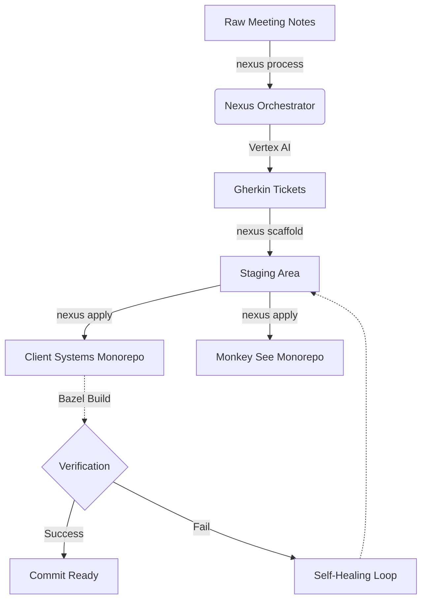

# Nexus: Examples & Workflows

This document outlines the standard Forward Deployed Engineering (FDE) workflows using the **Nexus** orchestrator.

## The Autonomous FDE Lifecycle



---

## 1. Processing Raw Notes (`nexus process`)

Top-tier FDEs take chaotic client meetings and instantly turn them into actionable engineering tickets.

**The Input (`client_meeting.md`):**
```markdown
# Sync with Acme Corp
They really need the dashboard to load faster. It's taking like 10 seconds.
Also, add a green/red status indicator for campaign health. Budget pacing is a must.
```

**The Command:**
```bash
$ nexus process client_meeting.md
```

**The Output (Automatically saved to `FDE_Plan.md`):**
```markdown
=== TICKET ===
TITLE: Frontend - Health Status Indicators
DESCRIPTION:
**User Story:** As a Campaign Manager, I want visual color-coded indicators so that I can quickly spot accounts needing attention.

**Technical Steps:**
- Create a lightweight fetch to `/user/preferences`
- Render Green, Yellow, or Red pill badges based on evaluation.

**Acceptance Criteria (Gherkin):**
Given a user preference where CPM >= $4.00 is Red
When the BFF returns an account with a $4.50 CPM
Then the frontend evaluates the raw number and renders a Red pill badge for that metric.

**Blockers & Edge Cases:**
- Blocker: Missing endpoints require fallback default thresholds.
```

---

## 2. Code Scaffolding (`nexus scaffold`)

Once the tickets are approved, Nexus delegates to the FDE Architect and Builder agents to write the code in an isolated sandbox.

**The Command:**
```bash
$ nexus scaffold TICKET-001
```

**Console Output:**
```text
[Nexus] Initializing Gemini 3.1 Pro via Vertex AI...
[Architect_Agent] Analyzing TICKET-001 for architectural constraints...
[Architect_Agent] Constraint added: Must use gRPC for backend communication.
[Builder_Agent] Generating Go scaffolding for client-systems/cmd/health-api...
[Builder_Agent] Generating TypeScript scaffolding for monkey-see/src/components/...
✅ Scaffolding complete in ./TICKET-001_Scaffold/
```

---

## 3. Applying and Verifying (`nexus apply`)

Nexus moves the code from the sandbox to the real monorepos and runs a strict verification loop.

**The Command:**
```bash
$ nexus apply ./TICKET-001_Scaffold
```

**Console Output:**
```text
[Nexus] Copying files to ~/workspace/github.com/gioadorno/client-systems...
[Nexus] Running Bazel Verification Loop...
$ bazel run //:gazelle
$ bazel build //...
INFO: Analyzed 42 targets (0 packages loaded, 0 targets configured).
INFO: Found 42 targets...
INFO: Elapsed time: 1.42s, Critical Path: 0.11s
INFO: 1 process: 1 internal.
✅ Build completed successfully.
🎉 Nexus deployment verified. Ready for commit.
```
